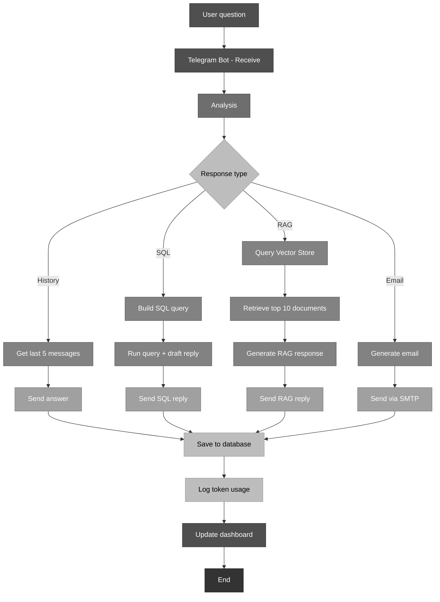
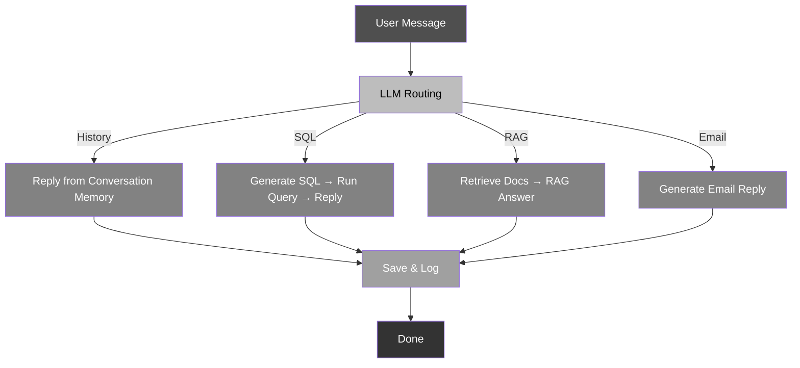
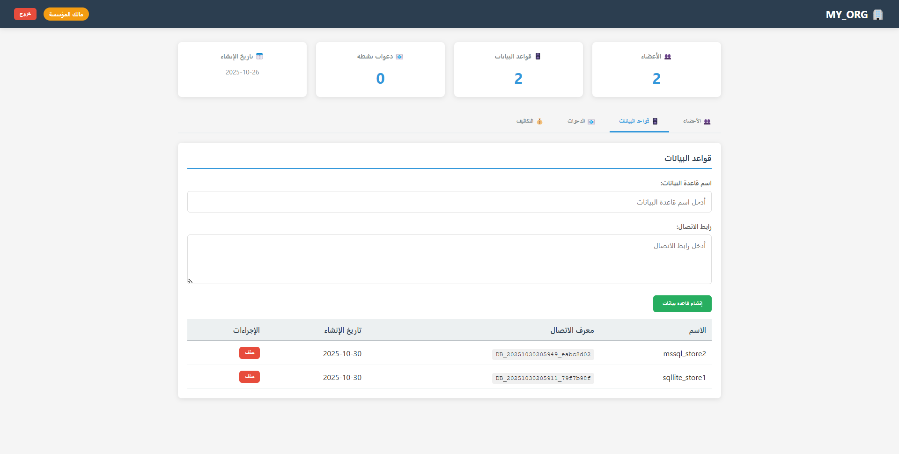
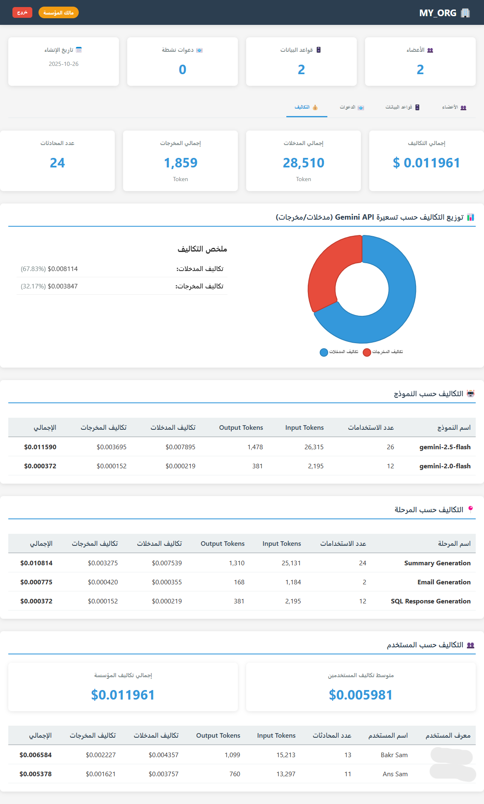

# Enterprise Telegram Bot + Dashboard System
⚠️ IMPORTANT NOTICE: This project code is currently NOT FOR PUBLIC RELEASE.

## System workflow






## Complete System Overview
[Watch the demo video](media/recording-2025-11-23-195942_PhthBOkp.mp4)

---

## 1. What Is This System?

This is an enterprise-grade ecosystem combining two integrated components:

- **Telegram Bot**: Mobile-first conversational interface for database querying, RAG-based document retrieval, and email automation
- **Web Dashboard**: Administrative interface for team management and cost analytics

Both interfaces share the same backend services, ensuring consistency and single source of truth. All data is persisted in SQL Server, providing enterprise-grade reliability and performance.

### The Problem It Solves
- Allow non-technical users to query databases without SQL knowledge
- Enable semantic search across document repositories using RAG (Retrieval-Augmented Generation)
- Collaborate securely on shared databases with role-based access
- Track AI usage costs transparently across all processing stages
- Maintain complete audit trails for compliance with full database persistence
- Automate report generation and email distribution

---

## 2. System Architecture

### Component Diagram

```
┌─────────────────────────────────────────────────┐
│              End Users (Dual Interface)          │
├──────────────────────┬──────────────────────────┤
│   Telegram Bot       │   Web Dashboard          │
│  (Mobile-First)      │   (Desktop)              │
│  • Natural language  │   • Team management      │
│  • Email generation  │   • Cost analytics       │
│  • Team invitations  │   • Database admin       │
│  • RAG search        │   • Document management  │
└──────────────┬───────┴──────────────┬───────────┘
               │                      │
               └──────────┬───────────┘
                          │
        ┌─────────────────┴──────────────────┐
        │  Shared Backend Services           │
        ├────────────────────────────────────┤
        │ • LLM Processing (Google Gemini)   │
        │ • Database Connection Management   │
        │ • User Authentication              │
        │ • Organization Management          │
        │ • Email Service (Gmail SMTP)       │
        │ • Vector Store (Pinecone)          │
        │ • Cost Tracking & Analytics        │
        │ • Activity Logging                 │
        └────────────────┬────────────────────┘
         ┌─────────────┬──┴──────┬──────────┐
         │  Manager    │ Pinecone│  Costs   │
         │  DB         │ Vector  │  DB      │
         │ (SQL Server)│ Store   │(SQL Svr) │
         └─────────────┴─────────┴──────────┘
              │
              ▼
         [Customer DBs]
         [SQL Server]
```

### Key Design Principles

1. **Shared Backend**: Both interfaces use identical business logic
2. **Multi-Tenant**: Complete organizational isolation
3. **Cost Transparent**: Every API call tracked and priced
4. **Audit First**: All actions logged with timestamps in persistent database
5. **Stateless**: Horizontally scalable architecture
6. **RAG-Enhanced**: Semantic document search via vector embeddings
7. **Database-Centric**: All data persisted in SQL Server (no JSON files)

---

## 3. User Roles & Permissions

### Role Hierarchy

```
ADMIN (System)
  └─ System-wide settings

ORG_OWNER (Organization Manager)
  ├─ Create/manage organization
  ├─ Add/remove databases
  ├─ Create member invitations
  ├─ Manage team members
  ├─ Manage document collections
  └─ View org statistics

ORG_MEMBER (Team Member)
  ├─ Query org databases
  ├─ Ask questions
  ├─ Search documents (RAG)
  ├─ View org info (read-only)
  └─ Send emails

USER (Standalone)
  ├─ Add personal databases
  ├─ Query own databases
  ├─ Upload documents to personal store
  ├─ Search documents (RAG)
  ├─ Create organization (becomes owner)
  └─ Join organization
```

### Access Control Matrix

| Action | Standalone | Org Owner | Org Member |
|--------|-----------|-----------|-----------|
| Create Org | ✓ | ✗ | ✗ |
| Add Org DB | ✗ | ✓ | ✗ |
| Add Personal DB | ✓ | ✗ | ✗ |
| Query Database | ✓ | ✓ | ✓ |
| Upload Documents | ✓ | ✓ | ✗ |
| Search Documents (RAG) | ✓ | ✓ | ✓ |
| Create Invitations | ✗ | ✓ | ✗ |
| Join Organization | ✓ | ✗ | ✗ |
| Remove Members | ✗ | ✓ | ✗ |
| View Costs | ✗ | ✓ | ✗ |

---

## 4. How It Works: User Flows

### Individual User Flow

```
User: /start
  ↓ (Bot registers user in database)
User: /adddb "Sales DB" "connection_string"
  ↓ (Bot validates connection, stores in DB)
User: /selectdb
  ↓ (User chooses database)
User: "What were Q4 sales?"
  ↓
Bot: 3-stage LLM processing
  1. Analyze intent → Generate SQL
  2. Execute SQL → Format results
  3. Generate email (if requested)
  ↓
Bot returns answer + cost breakdown
```

### RAG Search Flow

```
User: "Find information about marketing strategy"
  ↓
Bot: Analyzes intent as RAG query
  ↓
Stage 4: RAG Query Processing
  1. Convert question to embeddings (Gemini)
  2. Search Vector Store (Pinecone) - Top 10 results
  3. Retrieve relevant documents
  4. Generate response using context
  ↓
Bot returns synthesized answer with source context
  ↓
Save to database: Query, response, token usage, cost
```

### Organization Setup Flow

```
Owner: /createorg "Acme Corp"
  ↓ (Bot creates org in database, owner gets dashboard credentials)
Owner: Logs into dashboard
  ↓ (Dashboard loads from database)
Owner: Dashboard → Databases → Add new
  ↓ (Owner adds organization database, stored in DB)
Owner: Dashboard → Invitations → Create
  ↓ (Generate invitation code, persist in DB)
Owner: Shares code with team
  ↓
Member: /join <code>
  ↓ (Member joins organization, credentials stored in DB)
Member: /selectdb
  ↓ (Can now access shared organization databases)
Owner: Dashboard → Costs
  ↓ (Monitor member usage and costs from database)
```

---

## 5. Core Features

### Telegram Bot Features

**Commands**:
- `/start` - Initialize user
- `/help` - Show all commands
- `/createorg <name>` - Create organization
- `/adddb <name> <conn_str>` - Add database
- `/selectdb` - Choose active database
- `/invite [uses] [hours]` - Create member invitation
- `/join <code>` - Join organization
- `/orginfo` - View organization stats
- `/myinfo` - Show user profile
- `/stats` - Personal usage statistics
- `/history` - Last 10 questions
- `/clear` - Clear conversation history

**Capabilities**:
- Natural language database queries
- Automatic SQL generation from questions
- **RAG-based document search and retrieval**
- Multi-stage LLM processing (now with RAG stage)
- Email generation and sending
- Conversation history with sliding window cache
- Rate limiting and concurrency control
- Cost tracking per query and processing stage

### Web Dashboard Features

**Owner-Only Features**:
- Member management (add/remove/view)
 

- Database administration (add/remove/view)


- Document collection management (upload/organize/delete)
- Invitation creation and management
- Cost analytics (6 different views):
  - Total cost overview
  - Cost by AI model
  - Cost by processing stage (including RAG)
  - Input vs output breakdown
  - Per-user cost ranking
  - RAG usage statistics

**Member Features** (Read-Only):
- View organization members
- See available databases
- Check personal usage stats
- Access shared document collections

---

## 6. LLM Processing Pipeline

### 4-Stage Model

**Stage 1: Summary Generation** (Gemini-2.5-Flash)
- Input: Question + conversation history + database schema
- Output: SQL query (if needed), decision on processing method (SQL/History/RAG/Email)
- Purpose: Analyze intent and decide approach

**Stage 2: SQL Execution & Response** (Gemini-2.0-Flash) [Conditional]
- Input: SQL query from Stage 1
- Output: Natural language response
- Purpose: Execute and format results
- Skipped: If method is RAG or History

**Stage 3: Email Generation** (Gemini-2.5-Flash) [Optional]
- Input: SQL results or RAG results, email recipients
- Output: Email object (subject, body, recipients)
- Purpose: Generate professional email

**Stage 4: RAG Response Generation** (Gemini-2.0-Flash) [Conditional]
- Input: User question, retrieved documents from Vector Store (Top 10)
- Output: Synthesized answer based on document context
- Purpose: Semantic search and document-based Q&A
- Triggered: When intent analysis indicates RAG is best method
- Vector Store: Pinecone with Gemini embeddings

### Example: SQL Query

```
User: "What were Q4 sales?"

Stage 1: 
  LLM decides: "This is a SQL query request"
  Generates: SELECT region, SUM(amount) FROM sales WHERE year=2024 AND quarter=4

Stage 2:
  Executes query, gets results
  Formats: "Q4 Sales - East: $250K, West: $215K, South: $140K"

Result displayed with token cost: 2,235 tokens = $0.0156
```

### Example: RAG Query

```
User: "Find information about marketing strategy"

Stage 1:
  LLM decides: "This is a document search request (RAG)"
  Method: RAG

Stage 4: RAG Processing
  Converts question to embedding
  Searches Pinecone Vector Store
  Retrieves top 10 relevant documents
  Generates synthesis: "Based on our documents, marketing strategy includes..."
  Includes references to retrieved documents

Result displayed with token cost: 1,850 tokens = $0.0128
```

---

## 7. Cost Tracking

### What's Tracked

**Per Query**:
- Input tokens (question + context)
- Output tokens (LLM response)
- Cost per stage (Summary Gen, SQL Response, Email Gen, RAG Response)
- Model used (Gemini-2.5-Flash, Gemini-2.0-Flash)
- Processing time
- Vector store queries (RAG operations)

**Per User/Organization**:
- Total tokens consumed
- Total cost
- Breakdown by model
- Breakdown by processing stage (including RAG)
- RAG vs SQL query distribution
- Usage trends

### Cost Calculation

```
For each stage:
  input_cost = (input_tokens / 1,000,000) * input_price_per_million
  output_cost = (output_tokens / 1,000,000) * output_price_per_million
  stage_cost = input_cost + output_cost

Example (SQL Query):
  Stage 1 - Summary Gen
    Input: 342 tokens @ $0.075/1M = $0.0000256
    Output: 50 tokens @ $0.3/1M = $0.000015
    Subtotal: $0.0000406

  Stage 2 - SQL Response
    Input: 400 tokens @ $0.075/1M = $0.00003
    Output: 150 tokens @ $0.3/1M = $0.000045
    Subtotal: $0.000075

  Total: $0.0001156

Example (RAG Query):
  Stage 1 - Summary Gen
    Input: 350 tokens @ $0.075/1M = $0.0000262
    Output: 45 tokens @ $0.3/1M = $0.0000135
    Subtotal: $0.0000397

  Stage 4 - RAG Response
    Input: 2500 tokens @ $0.075/1M = $0.0001875
    Output: 400 tokens @ $0.3/1M = $0.00012
    Subtotal: $0.0002975

  Total: $0.0003372
```



---

## 8. Data Storage & Persistence

### SQL Server Database Schema

All application data is now persisted in SQL Server with the following main tables:

**User Management**:
- `users` - User profiles and roles
- `organizations` - Organization records
- `organization_members` - User-organization mappings
- `invitations` - Invitation codes and metadata

**Database Connections**:
- `databases` - Database connection strings and metadata
- `database_access` - Database access control

**Query & Conversation History**:
- `conversations` - Conversation records (replaces JSON files)
- `conversation_messages` - Individual messages within conversations
- `queries` - SQL queries executed with full context

**Cost & Analytics**:
- `cost_logs` - Detailed cost tracking per query and stage
- `ai_usage` - Token consumption by model and stage
- `processing_stages` - Individual stage metrics

**Documents & RAG**:
- `document_collections` - Managed document collections
- `documents` - Document metadata and content
- `rag_queries` - RAG search history and results

**Authentication**:
- `dashboard_users` - Dashboard login credentials
- `sessions` - Active session tokens

### Data Retention Policies

- Activity logs: Indefinite (SQL Server)
- Conversation history: Indefinite (SQL Server)
- In-memory cache: Last 5 conversations
- Cost database: Indefinite (SQL Server)
- Sensitive data: NOT stored (passwords hashed with PBKDF2, API keys in env vars only)

### Benefits of Database Persistence

✅ Complete audit trail available for compliance
✅ Advanced querying and analytics capabilities
✅ Horizontal scalability without file system dependencies
✅ Enterprise-grade backup and disaster recovery
✅ Real-time cost reporting from structured data
✅ Improved performance with proper indexing

---

## 9. Authentication

### Telegram Bot Auth

**User Identification**: Telegram user_id (unique, immutable)

**Automatic Registration**: On `/start` command
- Stores user ID, name, role in database
- Creates personal profile record
- Assigns role: USER (standalone)

**Role Assignment**:
- Automatic on first use (stored in DB)
- Changes when user creates org or joins org
- Can be admin if in ADMIN_TELEGRAM_IDS env var

### Dashboard Web Auth

**Login Process**:
1. User enters username + password
2. Backend validates against `dashboard_users` table in SQL Server
3. Password checked against PBKDF2 hash
4. Session token generated (32-byte secure random)
5. Token stored in `sessions` table (24-hour TTL)
6. All requests include: `Authorization: Bearer <token>`

**Credentials Generated**:
- Username: `{role}_{org_slug}_{user_id}` (auto-generated)
- Password: 16-byte random (sent via Telegram once)
- Both hashed before database storage
- New credentials for each new member

---

## 10. Email Service

### Email Generation

Triggered when user question mentions email keywords: "send", "report", "notify", etc.

**Process**:
1. LLM generates email subject and body
2. Bot displays preview to user
3. User clicks "Send Email"
4. Email sent via Gmail SMTP (asynchronously)
5. Logged in activity trail and cost database

### SMTP Configuration

```
Server: smtp.gmail.com:465 (SSL)
Auth: Gmail app-specific password
Sender: Configured via BOT_EMAIL env var
Template: Customizable greeting + body + signature
```

---

## 11. Vector Store & RAG Integration

### Pinecone Setup

**Index Configuration**:
- Index Name: `allinformations`
- Embedding Model: `models/gemini-embedding-001` (Google Generative AI)
- Vector Dimension: 768
- Metric: Cosine similarity
- 
**Retrieval Process**:
1. User asks question (RAG method detected)
2. Question converted to embedding
3. Top 10 similar documents retrieved from Pinecone
4. Documents passed to LLM as context
5. LLM generates synthesized answer
6. Query logged with source documents referenced

---

## 12. Logging & Audit

### What's Logged

- User registration and first-time setup
- Commands executed
- Questions asked and answers provided
- SQL queries executed with results
- RAG queries and retrieved documents
- Emails sent with recipients
- Database selections
- Organization actions
- Document uploads and deletions
- Errors and exceptions
- Rate limit events
- All logged to `conversations` and `conversation_messages` tables
- 
---

## 13. Rate Limiting & Concurrency

### Rate Limiter (Token Bucket)

**Per-User Settings**:
- Sustainable rate: 1 request/second
- Burst capacity: 3 requests
- Prevents: Server overload, runaway costs

### Concurrency Control

**Limit**: 1 active LLM request per user

**Behavior**:
```
User sends Q1 (processing)
  ↓
User sends Q2 immediately
  ↓
Bot: "Waiting for your previous answer..."
  ↓
Q1 completes
  ↓
Q2 begins processing
```

---

## 14. Conversation Memory

### Hybrid Memory Architecture

**Active Memory** (In-RAM):
- Last 5 conversations (10 messages)
- 5-minute TTL with auto-refresh
- Optimized for current session performance

**Persistent Record** (SQL Server):
- Complete conversation history
- Stored in `conversations` and `conversation_messages` tables
- Available for analytics and audit
- No file size limitations

### Benefits

- Prevents token bloat in current session
- Maintains conversation coherence
- Preserves complete audit trail in database
- Enables historical analysis
- Auto-cleanup prevents memory leaks

---

## 15. Technology Stack

**Backend**:
- Python 3.9+
- FastAPI (dashboard)
- python-telegram-bot (bot)
- SQLAlchemy (ORM)
- Google Gemini API (LLM)
- LangChain (RAG orchestration)

**Databases**:
- **SQL Server** (primary - all data persistence)
- SQLAlchemy supports: PostgreSQL, MySQL, SQLite (alternative)

**Vector Store**:
- Pinecone (semantic search and embeddings)
- Google Generative AI Embeddings (embedding generation)

**Services**:
- Gmail SMTP (email)
- Google Cloud (LLM & embeddings)
- Pinecone Cloud (vector storage)

---

## Summary

This system democratizes database access and document search through conversational AI while maintaining enterprise-grade security, cost transparency, and audit trails. It now combines structured SQL querying with semantic search capabilities via RAG, serving both individual power users and organizations with multi-tenant collaboration capabilities.

**Key Takeaways**:
- Dual interface (mobile bot + desktop dashboard)
- **4-stage LLM processing pipeline including RAG**
- **Semantic document search via Pinecone Vector Store**
- Complete cost visibility (token-level tracking across all stages)
- Enterprise security (RBAC, audit, organization isolation)
- **Full database persistence in SQL Server (no JSON files)**
- No SQL knowledge required for database queries
- No RAG expertise required for document search
- Horizontal scalability
- Production-ready architecture
