# Enterprise Telegram Bot + Dashboard System
## System workflows

⚠️ IMPORTANT NOTICE: This project code is currently NOT FOR PUBLIC RELEASE. The codebase is proprietary and under active development. Documentation is provided for internal reference and stakeholder review only.

### small workflow

```mermaid
graph TD
    Start["🚀 البداية"] --> TelegramChoice{المستخدم يختار}
    
    %% ===== TELEGRAM BOT PATH =====
    TelegramChoice -->|Telegram App| TBot["📱 Telegram Bot API"]
    TBot --> UserMsg["📨 رسالة المستخدم"]
    
    UserMsg --> BotChoice{نوع الرسالة؟}
    
    BotChoice -->|أمر| Command["⚙️ معالجة الأمر<br/>Python + FastAPI"]
    Command --> SaveDB["💾 حفظ في SQL Server<br/>users, organizations"]
    SaveDB --> TelegramReply["📤 رد Telegram"]
    
    BotChoice -->|سؤال| Question["🤖 معالجة السؤال"]
    Question --> Stage1["🔍 المرحلة 1: التحليل<br/>Gemini 2.5-Flash API"]
    
    Stage1 --> Decision{نوع الإجابة؟}
    
    Decision -->|SQL Query| Stage2["⚙️ المرحلة 2: تنفيذ SQL<br/>SQL Server<br/>Gemini 2.0-Flash"]
    Decision -->|إجابة مباشرة| Response1["📝 إجابة"]
    Decision -->|إيميل| Stage3["📧 المرحلة 3: إيميل<br/>Gemini 2.5-Flash API"]
    
    Stage2 --> FormatResults["📊 تنسيق النتائج<br/>Gemini 2.0-Flash"]
    FormatResults --> Response1
    
    Stage3 --> GenEmail["📧 توليد بريد<br/>Gmail SMTP"]
    GenEmail --> Response1
    
    Response1 --> SaveConversation["💾 حفظ المحادثة<br/>SQL Server<br/>JSON Storage"]
    SaveConversation --> TrackCost["💰 تتبع التكاليف<br/>حساب Tokens"]
    TrackCost --> SendTelegram["📤 إرسال الرد<br/>Telegram API"]
    SendTelegram --> Ready1["✅ انتظار رسالة جديدة"]
    
    %% ===== WEB DASHBOARD PATH =====
    TelegramChoice -->|Web Browser| Dashboard["🌐 Web Dashboard"]
    Dashboard --> Login["🔐 تسجيل الدخول"]
    Login --> AuthCheck["✅ التحقق<br/>SQL Server<br/>dashboard_users"]
    AuthCheck --> JWT["🔐 إنشاء JWT Token<br/>FastAPI"]
    JWT --> DashLoad["📊 تحميل لوحة التحكم"]
    
    DashLoad --> DashChoice{الصفحة المختارة؟}
    
    DashChoice -->|الأعضاء| Members["👥 إدارة الأعضاء<br/>FastAPI API"]
    Members --> MembersDB["💾 SQL Server<br/>organization_members"]
    
    DashChoice -->|القواعس| Databases["🗄️ إدارة قواعس البيانات<br/>FastAPI API"]
    Databases --> DBConn["🔌 اختبار الاتصال<br/>database_connections"]
    DBConn --> DBConnDB["💾 SQL Server<br/>database_connections"]
    
    DashChoice -->|الدعوات| Invites["🎫 إدارة الدعوات<br/>FastAPI API"]
    Invites --> InvDB["💾 SQL Server<br/>invitations"]
    
    DashChoice -->|التكاليف| Costs["💰 لوحة التكاليف<br/>FastAPI API"]
    Costs --> CostsDB["📊 استعلام<br/>SQL Server<br/>ModelUsage, StagesUsage"]
    CostsDB --> CostsDisplay["📈 عرض الرسوم البيانية<br/>JavaScript Charts"]
    
    Members --> UpdateUI["🔄 تحديث الواجهة<br/>React / HTML+JS"]
    Databases --> UpdateUI
    Invites --> UpdateUI
    CostsDisplay --> UpdateUI
    
    UpdateUI --> Logout["🔴 تسجيل الخروج<br/>حذف الجلسة"]
    Logout --> Ready2["✅ العودة لصفحة الدخول"]
    
    %% Connection back
    Ready1 --> TelegramChoice
    Ready2 --> TelegramChoice
    
    %% ===== Backend Infrastructure =====
    BackendGroup["🏗️ البنية التحتية<br/>Backend Infrastructure"]
    BackendGroup -.->|جميع الطلبات| FastAPI["⚡ FastAPI Server<br/>Python + Async/Await"]
    FastAPI -.->|قاعدة البيانات| SQLServer["💾 SQL Server<br/>SQLAlchemy ORM"]
    FastAPI -.->|الذكاء الاصطناعي| Gemini["🤖 Google Gemini API<br/>عدة نماذج"]
    FastAPI -.->|البريد الإلكتروني| Gmail["📧 Gmail SMTP<br/>إرسال الرسائل"]
    
    style Start fill:#0088cc,stroke:#005fa3,color:#fff
    style TBot fill:#0088cc,stroke:#005fa3,color:#fff
    style Stage1 fill:#e74c3c,stroke:#c0392b,color:#fff
    style Stage2 fill:#9b59b6,stroke:#7d3c98,color:#fff
    style Stage3 fill:#27ae60,stroke:#1e8449,color:#fff
    style Dashboard fill:#27ae60,stroke:#1e8449,color:#fff
    style Costs fill:#3498db,stroke:#2980b9,color:#fff
    style BackendGroup fill:#f39c12,stroke:#d68910,color:#fff
    style FastAPI fill:#e67e22,stroke:#d35400,color:#fff
```

```mermaid
graph TD
    Start["🚀 Smart Data System"] --> Choose{Choose Your Way}
    
    %% ===== TELEGRAM BOT =====
    Choose -->|"📱 Chat Bot"| Bot["Open Telegram Bot"]
    Bot --> Setup["First Time?<br/>Register in 1 click"]
    Setup --> Team{Join or Create?}
    
    Team -->|Create| Owner["👑 Create Your Team<br/>Get login info"]
    Team -->|Join| Member["👤 Join with invite code<br/>Get login info"]
    Team -->|Solo| Solo["🚶 Work alone"]
    
    Owner --> AddDB["Connect your database"]
    Member --> PickDB["Choose database"]
    Solo --> AddDB
    AddDB --> Ready["✅ Ready!"]
    PickDB --> Ready
    
    Ready --> Ask["💬 Ask any question<br/>in normal language"]
    Ask --> Example["'Show customers from January'<br/>'How many sales today?'"]
    Example --> Magic["🤖 AI finds the answer"]
    Magic --> Answer["📨 Get instant reply"]
    
    Answer --> Again{Ask more?}
    Again -->|Yes| Ask
    Again -->|No| Done1["✅ Done"]
    
    %% ===== WEB DASHBOARD =====
    Choose -->|"🌐 Dashboard"| Web["Open website"]
    Web --> Login["Login with info<br/>from Telegram"]
    Login --> Home["🏠 See your team overview"]
    
    Home --> Role{Your role?}
    
    Role -->|Member| CanView["You can:<br/>✓ View team<br/>✓ See databases"]
    Role -->|Owner| CanManage["You can:<br/>✓ Add/remove members<br/>✓ Add/remove databases<br/>✓ Create invites<br/>✓ See costs"]
    
    CanView --> Done2["✅ Done"]
    CanManage --> Done2
    
    %% ===== BENEFITS =====
    Done1 --> Why["✨ Why use this?"]
    Done2 --> Why
    
    Why --> B1["🔒 Secure - Your data is safe"]
    Why --> B2["💡 Smart - No coding needed"]
    Why --> B3["🤝 Team - Work together"]
    Why --> B4["💰 Clear - Track all costs"]
    
    B1 --> End["✅ Complete System"]
    B2 --> End
    B3 --> End
    B4 --> End
    
    style Start fill:#0088cc,stroke:#005fa3,color:#fff,stroke-width:4px
    style Ask fill:#e74c3c,stroke:#c0392b,color:#fff,stroke-width:3px
    style Magic fill:#9b59b6,stroke:#7d3c98,color:#fff,stroke-width:3px
    style Why fill:#f39c12,stroke:#d68910,color:#fff,stroke-width:3px
    style End fill:#2ecc71,stroke:#27ae60,color:#fff,stroke-width:4px
```




## Complete System Overview
---

## 1. What Is This System?

This is an enterprise-grade ecosystem combining two integrated components:

- **Telegram Bot**: Mobile-first conversational interface for database querying and email automation
- **Web Dashboard**: Administrative interface for team management and cost analytics

Both interfaces share the same backend services, ensuring consistency and single source of truth.

### The Problem It Solves

Organizations need a way to:
- Allow non-technical users to query databases without SQL knowledge
- Collaborate securely on shared databases with role-based access
- Track AI usage costs transparently 
- Maintain complete audit trails for compliance
- Automate report generation and email distribution

### Who It's For

- Individual knowledge workers seeking self-service database access
- Organizations requiring secure collaborative data exploration
- Enterprise teams needing usage tracking and cost allocation
- Finance & operations departments managing API costs

---

## 2. System Architecture

### Component Diagram

```
┌─────────────────────────────────────────────────┐
│              End Users (Dual Interface)          │
├──────────────────────┬──────────────────────────┤
│   Telegram Bot       │   Web Dashboard          │
│  (Mobile-First)      │   (Desktop)              │
│  • Natural language  │   • Team management      │
│  • Email generation  │   • Cost analytics       │
│  • Team invitations  │   • Database admin       │
└──────────────┬───────┴──────────────┬───────────┘
               │                      │
               └──────────┬───────────┘
                          │
        ┌─────────────────┴──────────────────┐
        │  Shared Backend Services           │
        ├────────────────────────────────────┤
        │ • LLM Processing (Google Gemini)   │
        │ • Database Connection Management   │
        │ • User Authentication              │
        │ • Organization Management          │
        │ • Email Service (Gmail SMTP)       │
        │ • Cost Tracking & Analytics        │
        │ • Activity Logging                 │
        └────────────────┬────────────────────┘
               ┌─────────┼─────────┐
         ┌─────▼──┐  ┌────▼──┐  ┌──▼─────┐
         │Manager │  │ Costs │  │Customer│
         │  DB    │  │  DB   │  │  DBs   │
         └────────┘  └───────┘  └────────┘
```

### Key Design Principles

1. **Shared Backend**: Both interfaces use identical business logic
2. **Multi-Tenant**: Complete organizational isolation
3. **Cost Transparent**: Every API call tracked and priced
4. **Audit First**: All actions logged with timestamps
5. **Stateless**: Horizontally scalable architecture

---

## 3. User Roles & Permissions

### Role Hierarchy

```
ADMIN (System)
  └─ System-wide settings

ORG_OWNER (Organization Manager)
  ├─ Create/manage organization
  ├─ Add/remove databases
  ├─ Create member invitations
  ├─ Manage team members
  └─ View org statistics

ORG_MEMBER (Team Member)
  ├─ Query org databases
  ├─ Ask questions
  ├─ View org info (read-only)
  └─ Send emails

USER (Standalone)
  ├─ Add personal databases
  ├─ Query own databases
  ├─ Create organization (becomes owner)
  └─ Join organization
```

### Access Control Matrix

| Action | Standalone | Org Owner | Org Member |
|--------|-----------|-----------|-----------|
| Create Org | ✓ | ✗ | ✗ |
| Add Org DB | ✗ | ✓ | ✗ |
| Add Personal DB | ✓ | ✗ | ✗ |
| Query Database | ✓ | ✓ | ✓ |
| Create Invitations | ✗ | ✓ | ✗ |
| Join Organization | ✓ | ✗ | ✗ |
| Remove Members | ✗ | ✓ | ✗ |
| View Costs | ✗ | ✓ | ✗ |

---

## 4. How It Works: User Flows

### Individual User Flow

```
User: /start
  ↓ (Bot registers user)
User: /adddb "Sales DB" "connection_string"
  ↓ (Bot validates connection)
User: /selectdb
  ↓ (User chooses database)
User: "What were Q4 sales?"
  ↓
Bot: 3-stage LLM processing
  1. Analyze intent → Generate SQL
  2. Execute SQL → Format results
  3. Generate email (if requested)
  ↓
Bot returns answer + cost breakdown
```

### Organization Setup Flow

```
Owner: /createorg "Acme Corp"
  ↓ (Bot creates org, owner gets dashboard credentials)
Owner: Logs into dashboard
  ↓ (Dashboard loads)
Owner: Dashboard → Databases → Add new
  ↓ (Owner adds organization database)
Owner: Dashboard → Invitations → Create
  ↓ (Generate invitation code)
Owner: Shares code with team
  ↓
Member: /join <code>
  ↓ (Member joins organization, gets dashboard credentials)
Member: /selectdb
  ↓ (Can now access shared organization databases)
Owner: Dashboard → Costs
  ↓ (Monitor member usage and costs)
```

---

## 5. Core Features

### Telegram Bot Features

**Commands**:
- `/start` - Initialize user
- `/help` - Show all commands
- `/createorg <name>` - Create organization
- `/adddb <name> <conn_str>` - Add database
- `/selectdb` - Choose active database
- `/invite [uses] [hours]` - Create member invitation
- `/join <code>` - Join organization
- `/orginfo` - View organization stats
- `/myinfo` - Show user profile
- `/stats` - Personal usage statistics
- `/history` - Last 10 questions
- `/clear` - Clear conversation history

**Capabilities**:
- Natural language database queries
- Automatic SQL generation from questions
- Multi-stage LLM processing
- Email generation and sending
- Conversation history with sliding window cache
- Rate limiting and concurrency control
- Cost tracking per query

### Web Dashboard Features

**Owner-Only Features**:
- Member management (add/remove/view)
- Database administration (add/remove/view)
- Invitation creation and management
- Cost analytics (5 different views):
  - Total cost overview
  - Cost by AI model
  - Cost by processing stage
  - Input vs output breakdown
  - Per-user cost ranking

**Member Features** (Read-Only):
- View organization members
- See available databases
- Check personal usage stats

---

## 6. LLM Processing Pipeline

### 3-Stage Model

**Stage 1: Summary Generation** (Gemini-2.5-Flash)
- Input: Question + conversation history + database schema
- Output: SQL query (if needed), decision on processing method
- Purpose: Analyze intent and decide approach

**Stage 2: SQL Execution & Response** (Gemini-2.0-Flash)
- Input: SQL query from Stage 1
- Output: Natural language response
- Purpose: Execute and format results

**Stage 3: Email Generation** (Gemini-2.5-Flash) [Optional]
- Input: SQL results, email recipients
- Output: Email object (subject, body, recipients)
- Purpose: Generate professional email

### Example: User Question

```
User: "Send Q4 sales by region to john@example.com"

Stage 1: 
  LLM decides: "This is an email request with SQL need"
  Generates: SELECT region, SUM(amount) FROM sales WHERE year=2024 AND quarter=4

Stage 2:
  Executes query, gets results
  Formats: "Q4 Sales - East: $250K, West: $215K, South: $140K"

Stage 3:
  Generates email subject: "Q4 Sales Breakdown by Region"
  Generates email body with formatted results
  Extracts recipient: john@example.com

Result displayed with token cost: 2,735 tokens = $0.0185
```

---

## 7. Cost Tracking

### What's Tracked

**Per Query**:
- Input tokens (question + context)
- Output tokens (LLM response)
- Cost per stage (Summary Gen, SQL Response, Email Gen)
- Model used (Gemini-2.5-Flash, Gemini-2.0-Flash)
- Processing time

**Per User/Organization**:
- Total tokens consumed
- Total cost
- Breakdown by model
- Breakdown by processing stage
- Usage trends

### Cost Calculation

```
For each stage:
  input_cost = (input_tokens / 1,000,000) * input_price_per_million
  output_cost = (output_tokens / 1,000,000) * output_price_per_million
  stage_cost = input_cost + output_cost

Example:
  Input: 342 tokens @ $0.075/1M = $0.0000256
  Output: 903 tokens @ $0.3/1M = $0.0002709
  Stage total: $0.0003
```

### Database Analytics

Costs stored in dedicated analytics database with tables:
- `ModelPricing` - Per-model pricing
- `Conversations` - Query records
- `ConversationStages` - Per-stage breakdown
- `ModelUsage` - Per-user model tracking
- `StagesUsage` - Per-user stage tracking
- `OrgModelUsage` - Per-organization model tracking
- `OrgStagesUsage` - Per-organization stage tracking

---

## 8. Authentication

### Telegram Bot Auth

**User Identification**: Telegram user_id (unique, immutable)

**Automatic Registration**: On `/start` command
- Stores user ID, name, role
- Creates personal profile
- Assigns role: USER (standalone)

**Role Assignment**:
- Automatic on first use
- Changes when user creates org or joins org
- Can be admin if in ADMIN_TELEGRAM_IDS env var

### Dashboard Web Auth

**Login Process**:
1. User enters username + password
2. Backend validates against dashboard_users table
3. Password checked against PBKDF2 hash
4. Session token generated (32-byte secure random)
5. Token stored in localStorage (24-hour TTL)
6. All requests include: `Authorization: Bearer <token>`

**Credentials Generated**:
- Username: `{role}_{org_slug}_{user_id}` (auto-generated)
- Password: 16-byte random (sent via Telegram once)
- Both hashed before database storage
- New credentials for each new member

---

## 9. Database Architecture

### Two-Database Design

**Manager Database**:
- Stores: Users, organizations, members, databases, invitations
- Purpose: Operational data
- Access: Both bot and dashboard

**Costs Database**:
- Stores: Token counts, costs, model pricing
- Purpose: Analytics and billing
- Access: Both bot and dashboard (dashboard mostly reads)

### Personal vs Organization Databases

**Personal Databases**:
- Owned by individual user
- Access: User only
- Managed via bot (/adddb command)
- Cannot be shared

**Organization Databases**:
- Owned by organization entity
- Access: All org members
- Managed via dashboard (owner only)
- Shared across team

---

## 10. Email Service

### Email Generation

Triggered when user question mentions email keywords: "send", "report", "notify", etc.

**Process**:
1. LLM generates email subject and body
2. Bot displays preview to user
3. User clicks "Send Email"
4. Email sent via Gmail SMTP (asynchronously)
5. Logged in activity trail and cost database

### SMTP Configuration

```
Server: smtp.gmail.com:465 (SSL)
Auth: Gmail app-specific password
Sender: Configured via BOT_EMAIL env var
Template: Customizable greeting + body + signature
```

---

## 11. Logging & Audit

### What's Logged

- User registration and first-time setup
- Commands executed
- Questions asked and answers provided
- SQL queries executed
- Emails sent
- Database selections
- Organization actions
- Errors and exceptions
- Rate limit events

### Log Files

```
logs/
  ├── bot.log                 # App startup/errors
  ├── telegram_activity.log   # User action audit trail
  ├── chat_<id>_activity.log  # Per-chat activity
  └── conversations/
      └── chat_<id>.json      # Full conversation history
```

### Data Retention

- Activity logs: Indefinite
- Conversation files: Last 1,000 per chat
- In-memory cache: Last 5 conversations
- Cost database: Indefinite
- Sensitive data: NOT logged (passwords, API keys)

---

## 12. Rate Limiting & Concurrency

### Rate Limiter (Token Bucket)

**Per-User Settings**:
- Sustainable rate: 1 request/second
- Burst capacity: 3 requests
- Prevents: Server overload, runaway costs

**Example**:
```
T=0s: User sends 3 questions (uses burst) ✓
T=0.1s: 4th question rejected (rate limited) ✗
T=1s: Bucket refilled, user can send again ✓
```

### Concurrency Control

**Limit**: 1 active LLM request per user

**Behavior**:
```
User sends Q1 (processing)
  ↓
User sends Q2 immediately
  ↓
Bot: "Waiting for your previous answer..."
  ↓
Q1 completes
  ↓
Q2 begins processing
```

---

## 13. Conversation Memory

### Sliding Window Architecture

**Active Memory** (In-RAM):
- Last 5 conversations (10 messages)
- 5-minute TTL with auto-refresh

**Historical Record** (File):
- Up to 1,000 conversations per chat
- Preserved for audit and analytics
- JSON format

### Benefits

- Prevents token bloat
- Maintains conversation coherence
- Preserves audit trail
- Auto-cleanup prevents memory leaks

---

## 15. Technology Stack

**Backend**:
- Python 3.9+
- FastAPI (dashboard)
- python-telegram-bot (bot)
- SQLAlchemy (ORM)
- Google Gemini API (LLM)

**Databases**:
- SQL Server (primary)
- SQLAlchemy supports: PostgreSQL, MySQL, SQLite

**Services**:
- Gmail SMTP (email)
- Google Cloud (LLM)

**Deployment**:
- Docker (containerization)
- Cloud Run / Fargate / App Engine (hosting)
- Cloud SQL / RDS (managed database)

---

## 16. Key Metrics

### Performance

- Query response time: 2-5 seconds average
- Rate limit: 1 request/second per user
- Max burst: 3 concurrent requests
- Token usage per query: 500-3,000 tokens typical
- Cost per query: $0.001-$0.02 typical

### Scalability

- Max users: Limited by database and LLM API quota
- Max organizations: Unlimited
- Max members per org: Unlimited
- Max databases per org: Unlimited
- Concurrent conversations: Limited by server capacity

### Reliability

- Uptime target: 99.5% (SLA in production)
- Session timeout: 24 hours (configurable)
- Connection pooling: Max 20 connections per instance
- Automatic failover: Database read replicas
- Error logging: Comprehensive with stack traces

---

## 17. Security Considerations

**Authentication**:
- Telegram user_id as primary identifier
- Session tokens (32-byte secure random)
- PBKDF2 password hashing (100,000 iterations)

**Authorization**:
- Role-based access control (RBAC)
- Organization isolation (no data leakage)
- Per-user database access verification

**Data Protection**:
- HTTPS/TLS for all communications
- Environment variables for secrets (no hardcoding)
- Sensitive data not logged
- Connection strings encrypted in production

**Audit**:
- Complete activity logs (who did what, when)
- SQL query logging
- Email send logging
- User action timestamps

---

## 18. Business Value

### For Individuals

- **Time Saved**: 5-10 minutes per query reduced to 30 seconds
- **Independence**: No IT ticket required
- **Learning**: Transparent SQL generation
- **Cost Visibility**: See exact API usage cost

### For Organizations

- **Productivity**: Team autonomy, faster decisions
- **Security**: Complete audit trail, role-based access
- **Cost Control**: Detailed tracking, identify inefficiencies
- **Compliance**: Timestamped logs for regulatory requirements
- **Efficiency**: Email automation, no manual reporting

### ROI Examples

- **IT Savings**: 20-30 hours/month of support time
- **Decision Speed**: 40-50% faster analysis
- **Cost Visibility**: 10-20% optimization through better practices
- **Operational Gain**: 5-10% revenue impact from faster decisions

---

## 19. Limitations

1. **One Organization Per User** (by design for billing simplicity)
2. **LLM Dependent** (requires internet connection to Google API)
3. **SQL Server Optimized** (other databases supported but less tested)
4. **Email Via Gmail** (limited to Gmail rate limits)
5. **Memory Scope** (last 5 conversations in active memory only)
6. **No Offline Mode** (requires cloud connectivity)

---

## 20. Future Enhancements

- Multi-organization membership for power users
- Custom LLM model selection per organization
- Advanced analytics (forecasting, anomaly detection)
- Slack integration
- Database encryption at rest
- SSO/OAuth integration
- API key authentication
- Webhook notifications
- Custom branding and templates
- Mobile app alternative to Telegram

---

## Summary

This system democratizes database access through conversational AI while maintaining enterprise-grade security, cost transparency, and audit trails. It serves both individual power users and organizations with multi-tenant collaboration capabilities.

**Key Takeaways**:
- Dual interface (mobile bot + desktop dashboard)
- Complete cost visibility (token-level tracking)
- Enterprise security (RBAC, audit, organization isolation)
- No SQL knowledge required
- Horizontal scalability
- Production-ready architecture
