# 🏢 Organization Dashboard - Complete Documentation

## Overview

```mermaid
graph TD
    Start["🌐 فتح الداشبورد"] --> Login["📄 صفحة تسجيل الدخول"]
    Login --> EnterCreds["إدخال اسم المستخدم وكلمة المرور"]
    EnterCreds --> SubmitLogin["إرسال POST /dashboard/login"]
    SubmitLogin --> QueryDB["🔍 البحث في dashboard_users"]
    QueryDB --> VerifyHash["التحقق من كلمة المرور"]
    VerifyHash --> Valid{صحيحة؟}
    
    Valid -->|لا| LoginError["❌ خطأ في بيانات الدخول"]
    LoginError --> EnterCreds
    
    Valid -->|نعم| CreateSession["🔐 إنشاء جلسة JWT"]
    CreateSession --> StoreSession["حفظ في _sessions<br/>مدة 24 ساعة"]
    StoreSession --> SaveLocal["💾 حفظ في localStorage"]
    SaveLocal --> RedirectDash["↪️ الانتقال إلى /dashboard/"]
    
    %% ===== الصفحة الرئيسية =====
    RedirectDash --> LoadDash["📊 تحميل لوحة المعلومات"]
    LoadDash --> GetOverview["GET /dashboard/overview"]
    GetOverview --> QueryOrg["🔍 استعلام organizations"]
    QueryOrg --> QueryMembers["🔍 عدد الأعضاء"]
    QueryMembers --> QueryDBs["🔍 عدد القواعد"]
    QueryDBs --> QueryInvites["🔍 الدعوات النشطة"]
    QueryInvites --> DisplayCards["📊 عرض البطاقات:<br/>👥 عدد الأعضاء<br/>🗄️ عدد القواعد<br/>🎫 الدعوات<br/>📅 تاريخ الإنشاء"]
    
    DisplayCards --> CheckRole{دور المستخدم؟}
    
    %% ===== عضو عادي =====
    CheckRole -->|عضو عادي| MemberView["👁️ عرض محدود"]
    MemberView --> HideTabs["❌ إخفاء التبويبات:<br/>- الدعوات<br/>- التكاليف"]
    HideTabs --> ShowMemberTabs["✅ عرض فقط:<br/>- الأعضاء (قراءة)<br/>- القواعد (قراءة + اختيار)"]
    ShowMemberTabs --> MemberTabSelect{التبويب؟}
    
    MemberTabSelect -->|الأعضاء| ViewMembers["👥 عرض الأعضاء<br/>(قراءة فقط)"]
    ViewMembers --> ShowMembersList["عرض:<br/>الاسم، الدور، التاريخ"]
    ShowMembersList --> MemberTabSelect
    
    MemberTabSelect -->|القواعد| ViewDBs["🗄️ عرض القواعد"]
    ViewDBs --> ShowDBsList["عرض قائمة القواعد"]
    ShowDBsList --> SelectOption["✅ إمكانية الاختيار"]
    SelectOption --> MemberTabSelect
    
    %% ===== مالك المؤسسة =====
    CheckRole -->|مالك المؤسسة| OwnerView["⚙️ عرض كامل"]
    OwnerView --> ShowAllTabs["✅ جميع التبويبات:<br/>- الأعضاء<br/>- القواعد<br/>- الدعوات<br/>- التكاليف"]
    ShowAllTabs --> OwnerTabSelect{التبويب المختار؟}
    
    %% ===== تبويب الأعضاء =====
    OwnerTabSelect -->|الأعضاء| MembersTab["👥 تبويب الأعضاء"]
    MembersTab --> GetMembers["GET /dashboard/members"]
    GetMembers --> QueryMembersList["🔍 استعلام organization_members"]
    QueryMembersList --> DisplayMembersTable["📋 عرض جدول الأعضاء"]
    DisplayMembersTable --> MemberAction{الإجراء؟}
    
    MemberAction -->|إضافة عضو| AddMemberForm["➕ نموذج إضافة عضو"]
    AddMemberForm --> EnterUserID["إدخال معرف المستخدم"]
    EnterUserID --> GenMemberCreds["🔐 توليد بيانات الدخول"]
    GenMemberCreds --> PostAddMember["POST /dashboard/members/add"]
    PostAddMember --> SaveMember["💾 حفظ في:<br/>- dashboard_users<br/>- organization_members"]
    SaveMember --> RefreshMembers["🔄 تحديث الجدول"]
    RefreshMembers --> MembersTab
    
    MemberAction -->|حذف عضو| ConfirmRemove["⚠️ تأكيد الحذف"]
    ConfirmRemove --> PostRemoveMember["POST /dashboard/members/remove"]
    PostRemoveMember --> DisconnectDBs["فصل عن القواعد"]
    DisconnectDBs --> DeleteMember["🗑️ حذف من:<br/>- organization_members<br/>- dashboard_users"]
    DeleteMember --> RefreshMembers
    
    MemberAction -->|عرض فقط| MembersTab
    
    %% ===== تبويب القواعد =====
    OwnerTabSelect -->|القواعد| DatabasesTab["🗄️ تبويب القواعد"]
    DatabasesTab --> GetDBs["GET /dashboard/databases"]
    GetDBs --> QueryDBsList["🔍 استعلام:<br/>- organization_databases<br/>- database_connections"]
    QueryDBsList --> DisplayDBsTable["📋 عرض جدول القواعد"]
    DisplayDBsTable --> DBAction{الإجراء؟}
    
    DBAction -->|إضافة قاعدة| AddDBForm["➕ نموذج إضافة قاعدة"]
    AddDBForm --> EnterDBInfo["إدخال:<br/>- الاسم<br/>- Connection String<br/>- النوع"]
    EnterDBInfo --> TestConnection["✅ اختبار الاتصال"]
    TestConnection --> ConnValid{صحيح؟}
    ConnValid -->|لا| ConnErr["❌ خطأ في الاتصال"]
    ConnErr --> AddDBForm
    ConnValid -->|نعم| PostAddDB["POST /dashboard/databases/create"]
    PostAddDB --> SaveDBConn["💾 حفظ في:<br/>- database_connections<br/>- organization_databases"]
    SaveDBConn --> NotifyAllMembers["📢 إشعار جميع الأعضاء"]
    NotifyAllMembers --> RefreshDBs["🔄 تحديث الجدول"]
    RefreshDBs --> DatabasesTab
    
    DBAction -->|حذف قاعدة| ConfirmDeleteDB["⚠️ تأكيد الحذف"]
    ConfirmDeleteDB --> PostRemoveDB["POST /dashboard/databases/remove"]
    PostRemoveDB --> ClearMemberCache["مسح من ذاكرة الأعضاء"]
    ClearMemberCache --> DeleteDBConn["🗑️ حذف من:<br/>- organization_databases<br/>- database_connections"]
    DeleteDBConn --> RefreshDBs
    
    DBAction -->|عرض فقط| DatabasesTab
    
    %% ===== تبويب الدعوات =====
    OwnerTabSelect -->|الدعوات| InvitationsTab["🎫 تبويب الدعوات"]
    InvitationsTab --> GetInvites["GET /dashboard/invitations"]
    GetInvites --> QueryInvites2["🔍 استعلام invitations"]
    QueryInvites2 --> DisplayInvitesTable["📋 عرض الدعوات:<br/>- النشطة<br/>- المنتهية"]
    DisplayInvitesTable --> InviteAction{الإجراء؟}
    
    InviteAction -->|إنشاء دعوة| CreateInviteForm["➕ نموذج دعوة جديدة"]
    CreateInviteForm --> SetInviteParams["تحديد:<br/>- عدد الاستخدامات<br/>- مدة الصلاحية"]
    SetInviteParams --> GenInviteCode["توليد رمز فريد"]
    GenInviteCode --> PostCreateInvite["POST /dashboard/invitations/create"]
    PostCreateInvite --> SaveInvite2["💾 حفظ في invitations"]
    SaveInvite2 --> DisplayInviteLink["📋 عرض رابط الدعوة"]
    DisplayInviteLink --> CopyLink["📋 نسخ الرابط"]
    CopyLink --> InvitationsTab
    
    InviteAction -->|عرض فقط| InvitationsTab
    
    %% ===== تبويب التكاليف =====
    OwnerTabSelect -->|التكاليف| CostsTab["💰 تبويب التكاليف"]
    CostsTab --> GetCosts["GET /dashboard/costs"]
    GetCosts --> QueryCostsDB["🔍 استعلام قاعدة التكاليف"]
    QueryCostsDB --> LoadCostData["تحميل البيانات من:<br/>- ModelUsage<br/>- StagesUsage<br/>- OrgModelUsage"]
    
    LoadCostData --> CostsSummary["📊 النظرة العامة"]
    CostsSummary --> DisplaySummaryCards["عرض البطاقات:<br/>💰 إجمالي التكاليف<br/>📥 إجمالي المدخلات<br/>📤 إجمالي المخرجات<br/>💬 عدد المحادثات"]
    
    DisplaySummaryCards --> CostsByModel["🤖 التكاليف حسب النموذج"]
    CostsByModel --> GetModelCosts["GET /dashboard/costs/by-model"]
    GetModelCosts --> QueryModelUsage["🔍 استعلام ModelUsage"]
    QueryModelUsage --> DisplayModelTable["📋 جدول النماذج:<br/>- اسم النموذج<br/>- عدد الاستخدامات<br/>- التوكنات<br/>- التكاليف"]
    
    DisplayModelTable --> CostsByStage["📈 التكاليف حسب المرحلة"]
    CostsByStage --> GetStageCosts["GET /dashboard/costs/by-stage"]
    GetStageCosts --> QueryStageUsage["🔍 استعلام StagesUsage"]
    QueryStageUsage --> DisplayStageTable["📋 جدول المراحل:<br/>- Analysis<br/>- SQL Execution<br/>- Email Generation"]
    
    DisplayStageTable --> CostsDistribution["📊 توزيع التكاليف"]
    CostsDistribution --> CalcIODistribution["حساب:<br/>- نسبة المدخلات<br/>- نسبة المخرجات"]
    CalcIODistribution --> DisplayPieChart["🥧 رسم بياني دائري"]
    DisplayPieChart --> DisplayDistTable["📋 جدول التوضيح"]
    
    DisplayDistTable --> CostsByUser["👥 التكاليف لكل مستخدم"]
    CostsByUser --> GetUserCosts["GET /dashboard/costs/by-user"]
    GetUserCosts --> QueryUserConvs["🔍 استعلام:<br/>- Conversations<br/>- ModelUsage"]
    QueryUserConvs --> CalcUserStats["حساب:<br/>- متوسط التكلفة/عضو<br/>- إجمالي المؤسسة"]
    CalcUserStats --> DisplayUserCards["📊 بطاقات الملخص"]
    DisplayUserCards --> DisplayUserTable["📋 جدول المستخدمين:<br/>- معرف المستخدم<br/>- اسم المستخدم<br/>- عدد المحادثات<br/>- التوكنات<br/>- التكاليف"]
    
    DisplayUserTable --> CostActions["⚙️ إجراءات إضافية"]
    CostActions --> CostActionSelect{الإجراء؟}
    CostActionSelect -->|تحديث| RefreshCosts["🔄 تحديث البيانات"]
    CostActionSelect -->|تصدير| ExportReport["📥 تصدير تقرير"]
    CostActionSelect -->|تنزيل| DownloadData["💾 تحميل CSV"]
    CostActionSelect -->|مسح| ClearFilters["🧹 مسح الفلاتر"]
    RefreshCosts --> CostsTab
    ExportReport --> CostsTab
    DownloadData --> CostsTab
    ClearFilters --> CostsTab
    CostActionSelect -->|رجوع| OwnerTabSelect
    
    %% ===== الرجوع والخروج =====
    MemberTabSelect -->|رجوع| CheckRole
    OwnerTabSelect -->|رجوع| CheckRole
    
    CheckRole --> LogoutAction{تسجيل الخروج؟}
    LogoutAction -->|نعم| ClickLogout["🔴 الضغط على الخروج"]
    ClickLogout --> PostLogout["POST /dashboard/logout"]
    PostLogout --> DeleteSession["🗑️ حذف الجلسة"]
    DeleteSession --> ClearStorage["مسح localStorage"]
    ClearStorage --> RedirectLogin["↪️ العودة لصفحة الدخول"]
    RedirectLogin --> Login
    
    LogoutAction -->|لا| CheckRole
    
    style Start fill:#0088cc,stroke:#005fa3,color:#fff
    style CreateSession fill:#27ae60,stroke:#1e8449,color:#fff
    style DisplayCards fill:#f39c12,stroke:#d68910,color:#fff
    style MemberView fill:#e74c3c,stroke:#c0392b,color:#fff
    style OwnerView fill:#27ae60,stroke:#1e8449,color:#fff
    style CostsTab fill:#3498db,stroke:#2980b9,color:#fff
    style ClickLogout fill:#95a5a6,stroke:#7f8c8d,color:#fff
```



The Dashboard is a web-based management interface for organizations using the Telegram Bot system. It provides organization owners and members with tools to manage team members, database connections, invitations, and monitor LLM usage costs.

**Key Capabilities:**
- Organization member management (add/remove members)
- Database connection management
- Invitation link creation and tracking
- Real-time cost analytics
- Token usage monitoring
- User and stage-wise cost breakdown
- Role-based access control

**Technology Stack:**
- Backend: FastAPI (Python)
- Frontend: HTML5, CSS3, JavaScript
- Charts: Chart.js
- Database: SQL Server (MSSQL)
- Storage: Sessions (in-memory with 24-hour TTL)

---

## Architecture

### Backend Architecture

```
FastAPI Application
├── /dashboard/main.py (Entry Point)
├── /dashboard/routes.py (API Endpoints)
├── /dashboard/auth.py (Session Management)
├── /dashboard/utils.py (Helper Functions)
└── /db_connection.py (Database Connections)
```

### Frontend Architecture

```
/dashboard/templates/
├── login.html (Authentication Page)
├── dashboard.html (Main Dashboard)
└── costs.html (Cost Analytics - Embedded in dashboard.html)

/dashboard/static/
├── /css/style.css (Styling)
├── /js/login.js (Login Logic)
└── /js/dashboard.js (Dashboard Logic)
```

### Data Flow

```
User Login
    ↓
Authentication (org_manager.authenticate_dashboard_user)
    ↓
Session Creation (24-hour TTL)
    ↓
Access Token (JWT-like via Bearer token)
    ↓
Authorized API Calls
    ↓
Data Retrieval & Rendering
```

---

## Features

### 1. Authentication

- **Login System**: Username/password authentication via dashboard users table
- **Session Management**: 24-hour session tokens stored in memory
- **Auto-Logout**: Sessions expire after 24 hours of creation
- **Secure Headers**: Bearer token authentication for all API requests

### 2. Member Management

**Owner Capabilities:**
- Add members directly by user ID
- Remove members (auto-disconnects from organization databases)
- View all members with roles
- Track member join dates

**Member Capabilities:**
- View organization member list (read-only)
- See own role and join date

### 3. Database Management

**Owner Capabilities:**
- Create new database connections
- Add connections from SQL connection string
- Link databases to organization (available to all members)
- Remove databases from organization
- View all linked databases

**Member Capabilities:**
- View available databases (read-only)
- Select active database for queries

### 4. Invitation System

**Owner Capabilities:**
- Generate time-limited invite links
- Set usage limits (1-N uses per link)
- View active and expired invitations
- Track invitation usage

**Features:**
- 24-hour default expiration
- Configurable max uses
- One-time use or multiple uses
- Automatic deactivation when limits reached

### 5. Cost Analytics (Owner Only)

**Overview Metrics:**
- Total organization costs
- Total tokens used (input + output)
- Total conversations

**Cost Breakdowns:**
- By model (Gemini-2.5-Flash, Gemini-2.0-Flash)
- By stage (Analysis, SQL Execution, Email Generation)
- Input vs Output costs with percentages
- Per-user costs with averages

**Visualizations:**
- Pie/Doughnut charts for input/output distribution
- Tables for detailed breakdowns
- Summary statistics

---

## Installation & Setup

### Prerequisites

- Python 3.8+
- SQL Server with accessible database (manager & costs databases)
- FastAPI dependencies installed
- Modern web browser

### Environment Setup

1. **Database Connection**
   ```python
   # db_connection.py
   DB_CONNECTION_STRING = "mssql+pyodbc://@SERVER\\INSTANCE/database?driver=ODBC+Driver+17+for+SQL+Server"
   DB_CONNECTION_STRING_2 = "mssql+pyodbc://@SERVER\\INSTANCE/costs?driver=ODBC+Driver+17+for+SQL+Server"
   ```

2. **Install Dependencies**
   ```bash
   pip install fastapi uvicorn sqlalchemy pyodbc
   ```

3. **Start Backend Server**
   ```bash
   cd dashboard/..
   python -m uvicorn main:app --host 127.0.0.1 --port 8000
   ```

4. **Access Dashboard**
   ```
   http://localhost:8000/
   ```

### Directory Structure Setup

```
project/
├── main.py
├── db_connection.py
├── dashboard/
│   ├── auth.py
│   ├── routes.py
│   ├── utils.py
│   ├── templates/
│   │   ├── login.html
│   │   └── dashboard.html
│   └── static/
│       ├── css/
│       │   └── style.css
│       └── js/
│           ├── login.js
│           └── dashboard.js
└── services/
    ├── organization_manager.py
    └── database_manager.py
```

---

## Project Structure

### Core Files

#### `main.py`
**Purpose**: FastAPI application entry point
**Responsibilities**:
- Create FastAPI app instance
- Mount static files (/static)
- Serve HTML templates
- Include router from dashboard.routes

**Key Routes**:
- `GET /` → login.html
- `GET /dashboard/` → dashboard.html
- `GET /costs/` → costs.html

#### `db_connection.py`
**Purpose**: Database connection management
**Contains**:
- Two database connections (manager & costs)
- SessionLocal instances
- Connection pooling configuration (NullPool)

**Databases**:
- `manager`: Organization and user data
- `costs`: Token usage and cost tracking

#### `routes.py`
**Purpose**: All API endpoint definitions
**Sections**:
- Authentication routes (login, logout, verify)
- Members management routes
- Databases management routes
- Invitations routes
- Cost tracking routes

**Total Endpoints**: 17

#### `auth.py`
**Purpose**: Session management
**Functions**:
- `create_session()`: Generate auth token
- `get_session()`: Retrieve session data
- `delete_session()`: Logout session
- `is_session_valid()`: Verify session validity

**Storage**: In-memory dictionary (not persistent)

#### `utils.py`
**Purpose**: Helper functions and decorators
**Contains**:
- `require_auth`: Decorator for protected routes
- `require_owner`: Decorator for owner-only routes
- `get_session_from_headers()`: Extract token from Authorization header

#### `style.css`
**Purpose**: Global styling
**Sections**:
- Login page styling
- Form styling
- Navigation bar
- Statistics cards
- Tabs and tables
- Responsive design
- Dark theme support

#### `login.js`
**Purpose**: Login page functionality
**Features**:
- Form validation
- API call to /dashboard/login
- Token storage in localStorage
- Error handling and display
- Loading state management

#### `dashboard.js`
**Purpose**: Main dashboard functionality
**Components**:
- Overview data loading
- Members management (load, add, remove)
- Databases management (load, create, remove)
- Invitations management (load, create)
- Cost analytics (multiple endpoints)
- Tab navigation
- Logout functionality
- Chart.js integration for visualizations

---

## API Reference

### Authentication Endpoints

#### POST `/dashboard/login`
**Purpose**: Authenticate user and create session

**Request**:
```json
{
  "username": "string",
  "password": "string"
}
```

**Response (Success)**:
```json
{
  "success": true,
  "message": "تم تسجيل الدخول بنجاح",
  "token": "random_token_string",
  "role": "owner|member",
  "org_id": "ORG_...",
  "org_name": "Organization Name",
  "user_id": 12345
}
```

**Response (Failure)**:
```json
{
  "success": false,
  "message": "،يانات الدخول غير صحيحة"
}
```

#### POST `/dashboard/logout`
**Purpose**: Terminate user session
**Auth**: Bearer token required
**Response**:
```json
{
  "success": true,
  "message": "تم تسجيل الخروج بنجاح"
}
```

#### GET `/dashboard/verify`
**Purpose**: Verify session validity
**Auth**: Bearer token required
**Response**:
```json
{
  "valid": true,
  "role": "owner|member",
  "org_id": "ORG_...",
  "username": "username"
}
```

### Overview Endpoint

#### GET `/dashboard/overview`
**Purpose**: Get organization dashboard summary
**Auth**: Bearer token required
**Response**:
```json
{
  "org": {
    "id": "ORG_...",
    "name": "Organization Name",
    "description": "...",
    "created_at": "2024-01-01T00:00:00"
  },
  "stats": {
    "members_count": 5,
    "databases_count": 3,
    "active_invitations": 2,
    "expired_invitations": 1,
    "created_at": "2024-01-01T00:00:00"
  },
  "user": {
    "role": "owner|member",
    "username": "username",
    "user_id": 12345
  },
  "permissions": {
    "is_owner": true,
    "is_member": false
  }
}
```

### Members Endpoints

#### GET `/dashboard/members`
**Purpose**: List all organization members
**Auth**: Bearer token required
**Response**:
```json
{
  "members": [
    {
      "user_id": 12345,
      "org_id": "ORG_...",
      "role": "owner|member",
      "joined_at": "2024-01-01T00:00:00"
    }
  ],
  "can_manage": true,
  "is_owner": true
}
```

#### POST `/dashboard/members/add`
**Purpose**: Add member to organization (Owner only)
**Auth**: Bearer token required
**Request**:
```json
{
  "user_id": 12345
}
```
**Response**:
```json
{
  "success": true,
  "message": "تم إضاÙØ© العضو بنجاح"
}
```

#### POST `/dashboard/members/remove`
**Purpose**: Remove member from organization (Owner only)
**Auth**: Bearer token required
**Request**:
```json
{
  "user_id": 12345
}
```
**Response**:
```json
{
  "success": true,
  "message": "تم الحذ٠بنجاح"
}
```

### Databases Endpoints

#### GET `/dashboard/databases`
**Purpose**: List organization databases
**Auth**: Bearer token required
**Response**:
```json
{
  "databases": [
    {
      "connection_id": "conn_id",
      "name": "Database Name",
      "created_at": "2024-01-01T00:00:00",
      "is_active": true,
      "owner_type": "organization",
      "added_at": "2024-01-01T00:00:00"
    }
  ],
  "count": 1,
  "can_manage": true,
  "is_owner": true
}
```

#### POST `/dashboard/databases/create`
**Purpose**: Create new database connection (Owner only)
**Auth**: Bearer token required
**Request**:
```json
{
  "name": "Database Name",
  "connection_string": "mssql+pyodbc://..."
}
```
**Response**:
```json
{
  "success": true,
  "message": "تم إنشاء قاعدة البيانات بنجاح",
  "connection_id": "conn_id",
  "name": "Database Name"
}
```

#### POST `/dashboard/databases/remove`
**Purpose**: Remove database from organization (Owner only)
**Auth**: Bearer token required
**Request**:
```json
{
  "connection_id": "conn_id"
}
```
**Response**:
```json
{
  "success": true,
  "message": "تم الحذ٠بنجاح"
}
```

### Invitations Endpoints

#### GET `/dashboard/invitations`
**Purpose**: List all invitations (Owner only)
**Auth**: Bearer token required
**Response**:
```json
{
  "invitations": [
    {
      "code": "random_code",
      "created_at": "2024-01-01T00:00:00",
      "expires_at": "2024-01-02T00:00:00",
      "max_uses": 5,
      "current_uses": 2,
      "is_active": true
    }
  ]
}
```

#### POST `/dashboard/invitations/create`
**Purpose**: Create new invitation (Owner only)
**Auth**: Bearer token required
**Request**:
```json
{
  "max_uses": 5
}
```
**Response**:
```json
{
  "success": true,
  "code": "random_code",
  "link": "https://yoursite.com/join/random_code"
}
```

### Cost Endpoints (Owner Only)

#### GET `/dashboard/costs/overview`
**Purpose**: Get total cost overview
```json
{
  "success": true,
  "total_stats": {
    "total_cost": 12.345678,
    "total_input_tokens": 100000,
    "total_output_tokens": 50000,
    "total_conversations": 150
  }
}
```

#### GET `/dashboard/costs/by-model`
**Purpose**: Get costs grouped by LLM model
```json
{
  "success": true,
  "models": [
    {
      "model_name": "gemini-2.5-flash",
      "usage_count": 100,
      "total_input_tokens": 80000,
      "total_output_tokens": 40000,
      "total_tokens": 120000,
      "total_input_cost": 0.8,
      "total_output_cost": 0.4,
      "total_cost": 1.2
    }
  ]
}
```

#### GET `/dashboard/costs/by-stage`
**Purpose**: Get costs grouped by processing stage
```json
{
  "success": true,
  "stages": [
    {
      "stage_name": "Summary Generation",
      "usage_count": 100,
      "total_input_tokens": 50000,
      "total_output_tokens": 20000,
      "total_tokens": 70000,
      "total_input_cost": 0.5,
      "total_output_cost": 0.2,
      "total_cost": 0.7
    }
  ]
}
```

#### GET `/dashboard/costs/input-output`
**Purpose**: Get input vs output cost breakdown
```json
{
  "success": true,
  "input_cost": 5.6,
  "output_cost": 3.4,
  "total_cost": 9.0,
  "input_percentage": 62.22,
  "output_percentage": 37.78
}
```

#### GET `/dashboard/costs/per-user`
**Purpose**: Get costs per user
```json
{
  "success": true,
  "users": [
    {
      "user_id": 12345,
      "username": "user1",
      "conversations_count": 50,
      "total_input_tokens": 40000,
      "total_output_tokens": 20000,
      "total_tokens": 60000,
      "total_input_cost": 0.4,
      "total_output_cost": 0.2,
      "total_cost": 0.6
    }
  ],
  "total_org_cost": 2.5,
  "average_cost_per_user": 0.625,
  "total_users": 4
}
```

---

## Frontend Components

### Login Page (`login.html`)

**Elements**:
- Login container with gradient background
- Username and password input fields
- Form validation
- Error message display
- Loading spinner during authentication
- Submit button

**JavaScript Functionality** (`login.js`):
- Form submission handler
- API call to POST /dashboard/login
- Token and user data storage in localStorage
- Error handling and display
- Redirect to dashboard on success

### Dashboard Page (`dashboard.html`)

**Layout**:
```
Navigation Bar
├── Organization Name
└── User Role + Logout Button

Statistics Cards Grid
├── Members Count
├── Databases Count
├── Active Invitations
└── Creation Date

Tab Navigation
├── Members Tab
├── Databases Tab
├── Invitations Tab
└── Costs Tab (Owner only)
```

**Tab Contents**:

1. **Members Tab**
   - Add member form (Owner only)
   - Members table with columns: ID, Role, Join Date, Actions
   - Remove button (Owner only)

2. **Databases Tab**
   - Create database form (Owner only)
   - Databases table with columns: Name, Connection ID, Created Date, Actions
   - Remove button (Owner only)

3. **Invitations Tab** (Owner only)
   - Create invitation form
   - Invitations table with columns: Code, Uses, Expiration, Status

4. **Costs Tab** (Owner only)
   - Overview statistics cards
   - Input/Output cost pie chart
   - Costs by model table
   - Costs by stage table
   - Costs per user table
   - Average cost calculations

### Styling (`style.css`)

**Key Classes**:
- `.login-page`: Login background and centering
- `.navbar`: Top navigation styling
- `.stats-grid`: Responsive statistics grid
- `.tab-btn`: Tab button styling
- `.tab-content`: Tab content visibility
- `.table-responsive`: Responsive table wrapper
- `.btn`: Button base styling
- `.role-badge`: Role indicator styling

**Color Scheme**:
- Primary: #3498db (Blue)
- Danger: #e74c3c (Red)
- Success: #27ae60 (Green)
- Accent: #f39c12 (Orange)
- Background: #f5f5f5 (Light Gray)

**Responsive Design**:
- Mobile breakpoint: 768px
- Grid columns adjust for smaller screens
- Flexbox for flexible layouts

---

## Authentication System

### Session Management

**Creation**:
```python
token = create_session(
    org_id="ORG_...",
    user_id=12345,
    role="owner",
    org_name="Organization Name",
    username="username"
)
```

**Storage**:
- In-memory dictionary: `_sessions[token] = {...}`
- Created timestamp for expiration tracking
- 24-hour timeout

**Retrieval**:
```python
session = get_session(token)
# Returns session data if valid and not expired
# Returns None if expired or invalid
```

**Validation**:
- Check token exists in dictionary
- Check expiration (24 hours from creation)
- Auto-delete expired sessions

### Token Usage

**Header Format**:
```
Authorization: Bearer {token}
```

**Extraction**:
```python
token = get_session_from_headers(authorization)
# Removes "Bearer " prefix and returns token
```

**Verification Flow**:
1. Extract token from Authorization header
2. Validate token exists and is not expired
3. If valid, allow access; otherwise return 401

---

## User Roles & Permissions

### Role Types

#### Owner Role
**Capabilities**:
- All member capabilities
- Add members directly
- Remove members
- Create/remove databases
- Create invitations
- View cost analytics
- Access all cost reports
- Manage organization settings

**Restrictions**:
- Cannot remove self (if implementing)
- Cannot modify owner role (if implementing)

#### Member Role
**Capabilities**:
- View organization info
- View member list
- View available databases
- Select active database
- View team statistics

**Restrictions**:
- Cannot add/remove members
- Cannot manage databases
- Cannot create invitations
- Cannot view cost details
- Cannot manage organization

### Permission Matrix

| Action | Owner | Member |
|--------|-------|--------|
| View Members | ✓ | ✓ |
| Add Member | ✓ | ✗ |
| Remove Member | ✓ | ✗ |
| View Databases | ✓ | ✓ |
| Create Database | ✓ | ✗ |
| Remove Database | ✓ | ✗ |
| Create Invitation | ✓ | ✗ |
| View Invitations | ✓ | ✗ |
| View Costs | ✓ | ✗ |
| View Cost Breakdown | ✓ | ✗ |

---

## Database Integration

### Database Connections

**Two Separate Databases**:

1. **Manager Database** (`manager`)
   - Tables: organizations, organization_members, dashboard_users, database_connections, organization_databases, invitations, etc.
   - Purpose: Organization and member management

2. **Costs Database** (`costs`)
   - Tables: ModelUsage, StagesUsage, OrgModelUsage, OrgStagesUsage, Conversations, ConversationStages, ConversationSummary
   - Purpose: Token and cost tracking

### Connection Configuration

```python
# Manager DB
DB_CONNECTION_STRING = "mssql+pyodbc://@SERVER\\INSTANCE/manager?driver=ODBC+Driver+17+for+SQL+Server"
engine = create_engine(DB_CONNECTION_STRING, poolclass=NullPool, echo=False)
SessionLocal = sessionmaker(autocommit=False, autoflush=False, bind=engine)

# Costs DB
DB_CONNECTION_STRING_2 = "mssql+pyodbc://@SERVER\\INSTANCE/costs?driver=ODBC+Driver+17+for+SQL+Server"
engine_2 = create_engine(DB_CONNECTION_STRING_2, poolclass=NullPool, echo=False)
SessionLocal_2 = sessionmaker(autocommit=False, autoflush=False, bind=engine_2)
```

### Queries

**All queries use SQLAlchemy `text()` for raw SQL execution**:

```python
result = db.execute(text("""
    SELECT * FROM organizations
    WHERE org_id = :org_id
"""), {'org_id': session['org_id']})
```

---

## Cost Tracking System

### Cost Data Aggregation

**Metrics Tracked**:
- Input tokens per stage/model/user
- Output tokens per stage/model/user
- Total tokens
- Costs (input + output)
- Usage count

### Cost Calculation

**Per Model**:
```
Total Cost = (Input Tokens / 1,000,000 × Input Price) + (Output Tokens / 1,000,000 × Output Price)
```

**Price Reference**:
- Pulled from ModelPricing table
- Different for each model (Gemini 2.5-Flash vs 2.0-Flash)

### Reports Generated

1. **Overview**: Total costs, tokens, conversations
2. **By Model**: Breakdown per LLM model used
3. **By Stage**: Breakdown per processing stage
4. **Input/Output**: Percentage split of costs
5. **Per User**: Individual and average user costs

### Visualization

**Chart.js Integration**:
- Pie/Doughnut chart for input/output distribution
- Responsive and interactive
- Displays percentages and values on hover
- Auto-destroys and recreates on data refresh

---

## Usage Guide

### First-Time Setup

1. **Login**
   - Navigate to http://localhost:8000/
   - Enter dashboard user credentials (created when organization was established)
   - System verifies credentials against dashboard_users table

2. **Review Organization**
   - Dashboard displays organization info and statistics
   - Owner can see cost analytics immediately
   - Member sees limited information

### Common Tasks

#### As Organization Owner

**Add a Member**:
1. Go to "Members" tab
2. Enter user's Telegram ID
3. Click "Add Member" button
4. System validates user exists and isn't in another org
5. Generates dashboard credentials for new member

**Create Database Connection**:
1. Go to "Databases" tab
2. Enter database name and connection string
3. Click "Create Database"
4. System validates connection
5. All members gain access immediately

**Generate Invitation Link**:
1. Go to "Invitations" tab
2. Enter max uses (default 1)
3. Click "Create Invitation"
4. Copy invite code or link
5. Share with new member
6. Member joins via `/join <code>` in Telegram

**Monitor Costs**:
1. Go to "Costs" tab (Owner only)
2. View overview statistics
3. Click through different breakdowns
4. Use pie chart to visualize input/output ratio
5. Identify expensive models or stages
6. Track per-user spending

#### As Team Member

**Select Active Database**:
1. Go to "Databases" tab
2. View available databases
3. Click to select as active
4. Return to Telegram bot to use
5. All queries will use selected database

**View Statistics**:
1. Review "Members" tab to see team
2. Check database availability
3. Cannot access "Costs" or "Invitations" tabs
4. Can only view read-only information

### Dashboard Navigation

**Tab Switching**:
- Click any tab button to switch sections
- Content updates dynamically
- Current tab highlighted in blue

**Data Refresh**:
- Manual: Reload page (F5 or Ctrl+R)
- Automatic: Some actions trigger refresh
- No real-time auto-refresh (pull-based)

**Logout**:
- Click "Logout" button in top-right
- Session deleted
- Redirected to login page
- Session token cleared from localStorage

---

## Security Considerations

### Current Security Issues

⚠️ **Important**: The following security issues should be addressed before production:

1. **Plaintext Password Check**: Hardcoded "beko515" password check
2. **In-Memory Sessions**: No persistence or replication
3. **No CSRF Protection**: Forms don't validate CSRF tokens
4. **No Rate Limiting**: Brute force attacks possible
5. **Bearer
